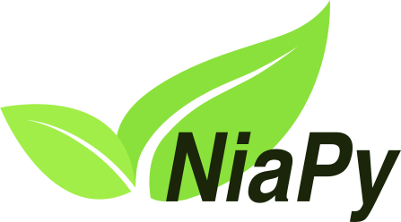

[](https://travis-ci.org/NiaOrg/NiaPy) [](https://ci.appveyor.com/project/GregaVrbancic/niapy) [](https://coveralls.io/r/NiaOrg/NiaPy) [](https://pypi.python.org/pypi/NiaPy) [](https://pypistats.com/package/niapy) [](http://niapy.readthedocs.io/en/latest/?badge=latest) [](http://isitmaintained.com/project/NiaOrg/NiaPy "Average time to resolve an issue") [](http://isitmaintained.com/project/NiaOrg/NiaPy "Percentage of issues still open") [](https://github.com/NiaOrg/NiaPy/blob/master/LICENSE)

[](https://doi.org/10.5281/zenodo.1205048) [](https://doi.org/10.21105/joss.00613)

# About

Nature-inspired algorithms are a very popular tool for solving optimization problems. Numerous variants of [nature-inspired algorithms have been developed](https://arxiv.org/abs/1307.4186) since the beginning of their era. To prove their versatility, those were tested in various domains on various applications, especially when they are hybridized, modified or adapted. However, implementation of nature-inspired algorithms is sometimes a difficult, complex and tedious task. In order to break this wall, NiaPy is intended for simple and quick use, without spending time for implementing algorithms from scratch.

<p align="center"></p>

# Mission

Our mission is to build a collection of nature-inspired algorithms and create a simple interface for managing the optimization process. NiaPy will offer:

- numerous benchmark functions implementations,
- use of various nature-inspired algorithms without struggle and effort with a simple interface,
- easy comparison between nature-inspired algorithms and
- export of results in various formats (LaTeX, JSON, Excel).

# Overview

Python micro framework for building nature-inspired algorithms. Official documentation is available [here](http://niapy.readthedocs.io/en/1.0.0).

The micro framework features following algorithms:

- basic:
  - Artificial bee colony algorithm ([see example](examples/run_abc.py))
  - Bat algorithm ([see example](examples/run_ba.py))
  - Camel algorithm ([see example](example/run_ca.py))
  - Differential evolution algorithm ([see example](examples/run_de.py))
  - Evolution Strategy ([see example](example/run_es1p1.py), [see example](example/run_esMp1.py), [see example](example/run_esMpL.py), [see example](example/run_esML.py))
  - Firefly algorithm ([see example](examples/run_fa.py))
  - Fireworks algorithm ([see example](examples/run_fwa.py), [see example](examples/run_efwa.py), [see example](examples/run_dfwa.py), [see example](examples/run_bbfwa.py))
  - Flower pollination algorithm ([see example](examples/run_fpa.py))
  - Genetic algorithm ([see example](examples/run_ga.py))
  - Glowworm Swarm Optimization ([see example](examples/run_gso.py), [see example](examples/run_gsov1.py), [see example](examples/run_gsov2.py), [see example](examples/run_gsov3.py))
  - Grey wolf optimizer ([see example](examples/run_gwo.py))
  - Harmony Search Algorithm ([see example](examples/run_hs.py))
  - Krill Herd Algorithm ([see example](examples/run_khv1.py), [see example](examples/run_khv2.py), [see example](examples/run_khv3.py), [see example](examples/run_khv4.py), [see example](examples/run_khV11.py))
  - Monkey King Evolution ([see example](examples/run_mkev1.py), [see example](examples/run_mkev2.py), [see example](examples/run_mkev3.py))
  - Multiple trajectory search ([see example](examples/run_mts.py), [see example](examples/run_mtsv1.py))
  - Particle swarm optimization ([see example](examples/run_pso.py))
  - Sine Cosine Algorithm ([see example](examples/run_sca.py))
- modified:
  - Hybrid bat algorithm ([see example](examples/run_hba.py))
  - Self-adaptive differential evolution algorithm ([see example](examples/run_jde.py))
  - Dynamic population size self-adaptive differential evolution algorithm ([see example](examples/run_dynnpjde.py))
- other:
  - Anarchic society optimization algorithm ([see example](examples/run_aso.py))
  - Hill climbing algorithm ([see example](examples/run_ihc.py))
  - Multiple trajectory search ([see example](examples/run_mts.py))
  - Nelder mead method or downhill simplex method or amoeba method ([see example](examples/run_nmm.py))
  - Simulated annealing algorithm
  
The following benchmark functions are included in NiaPy:
- Ackley
- Alpine
  - Alpine1
  - Alpine2
- Bent Cigar
- Chung Reynolds
- Csendes
- Discus
- Dixon-Price
- Elliptic
- Griewank
- Happy cat
- HGBat
- Katsuura
- Levy
- Michalewicz
- Perm
- Pintér
- Powell
- Qing
- Quintic
- Rastrigin
- Ridge
- Rosenbrock
- Salomon
- Schumer Steiglitz
- Schwefel
  - Schwefel 2.21
  - Schwefel 2.22
- Sphere
  - Sphere2 -> Sphere with different powers
  - Sphere3 -> Rotated hyper-ellipsoid
- Step
  - Step2
  - Step3
- Stepint
- Styblinski-Tang
- Sum Squares
- Trid
- Weierstrass
- Whitley
- Zakharov

# Setup

## Requirements

- Python 3.6+ (backward compatibility with 2.7.14)
- Pip

### Dependencies

- click == *
- numpy == 1.14.0
- scipy == 1.0.0
- xlsxwriter == 1.0.2
- matplotlib == *

List of development dependencies and requirements can be found [here](CONTRIBUTING.md#development-dependencies).

## Installation

Install NiaPy with pip:

```sh
$ pip install NiaPy
```

or directly from the source code:

```sh
$ git clone https://github.com/NiaOrg/NiaPy.git
$ cd NiaPy
$ python setup.py install
```

# Usage

After installation, the package can imported:

```sh
$ python
>>> import NiaPy
>>> NiaPy.__version__
```

For more usage examples please look at **examples** folder.

More advanced examples can also be found in the [NiaPy-examples repository](https://github.com/NiaOrg/NiaPy-examples).

# Cite us

Are you using NiaPy in your project or research? Please cite us!

- Plain format

```
      Vrbančič, G., Brezočnik, L., Mlakar, U., Fister, D., & Fister Jr., I. (2018).
      NiaPy: Python microframework for building nature-inspired algorithms.
      Journal of Open Source Software, 3(23), 613\. <https://doi.org/10.21105/joss.00613>
```

- Bibtex format

```
    @article{NiaPyJOSS2018,
        author  = {Vrban{\v{c}}i{\v{c}}, Grega and Brezo{\v{c}}nik, Lucija
                  and Mlakar, Uro{\v{s}} and Fister, Du{\v{s}}an and {Fister Jr.}, Iztok},
        title   = {{NiaPy: Python microframework for building nature-inspired algorithms}},
        journal = {{Journal of Open Source Software}},
        year    = {2018},
        volume  = {3},
        issue   = {23},
        issn    = {2475-9066},
        doi     = {10.21105/joss.00613},
        url     = {https://doi.org/10.21105/joss.00613}
    }
```

- RIS format

```
    TY  - JOUR
    T1  - NiaPy: Python microframework for building nature-inspired algorithms
    AU  - Vrbančič, Grega
    AU  - Brezočnik, Lucija
    AU  - Mlakar, Uroš
    AU  - Fister, Dušan
    AU  - Fister Jr., Iztok
    PY  - 2018
    JF  - Journal of Open Source Software
    VL  - 3
    IS  - 23
    DO  - 10.21105/joss.00613
    UR  - http://joss.theoj.org/papers/10.21105/joss.00613
```

## Contributing

[](https://www.codetriage.com/niaorg/niapy)

We encourage you to contribute to NiaPy! Please check out the [Contributing to NiaPy guide](CONTRIBUTING.md) for guidelines about how to proceed.

Everyone interacting in NiaPy's codebases, issue trackers, chat rooms and mailing lists is expected to follow the NiaPy [code of conduct](CODE_OF_CONDUCT.md).

## Contributors
[](https://github.com/GregaVrbancic) |[](https://github.com/firefly-cpp) |[](https://github.com/lucijabrezocnik) |[](https://github.com/mlaky88) |[](https://github.com/rhododendrom) |[](https://github.com/kb2623)| [](https://github.com/Flyzoor) |
:---: |:---: |:---: |:---: |:---: |:---: |:---: |
[GregaVrbancic](https://github.com/GregaVrbancic) |[firefly-cpp](https://github.com/firefly-cpp) |[lucijabrezocnik](https://github.com/lucijabrezocnik) |[mlaky88](https://github.com/mlaky88) |[rhododendrom](https://github.com/rhododendrom) |[kb2623](https://github.com/kb2623) |[Flyzoor](https://github.com/Flyzoor) |


## Licence

This package is distributed under the MIT License. This license can be found online at <http://www.opensource.org/licenses/MIT>.

## Disclaimer

This framework is provided as-is, and there are no guarantees that it fits your purposes or that it is bug-free. Use it at your own risk!
