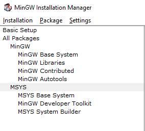

MinGW Installation Guide - Windows
==================================

Download MinGW installer from `here <http://mingw.org/download/installer>`_.

.. warning::

    **Important!** 
    Before running the MinGW installer disable any running antivirus and firewall. 
    Afterwards run MinGW installer as Administrator.

Follow the installation wizard clicking **Continue**.

After the installation procedure is completed MinGW Installation Manager is opened.

In tree navigation on the left side of window select **All Packages** > **MSYS** like is 
shown in figure below.

On the right side of window, search for packages **msys-make** and **msys-bash**. Right 
click on each package and select **Mark for installation** from context menu.

Next click on the **Installation** in top menu and select **Apply Changes** and again 
**Apply**.

The last thing is to add binaries to system variables. Go to **Control panel** > 
**System and Security** > **System** and click on **Advanced system settings**. Then 
click on **Environment Variables...** button and on list in new window mark entry with 
variable **Path**. Next, click on **Edit...** button and create new entry with value 
equal to: <MinGW_install_path>\\msys\\1.0\\bin (by default it is: C:\\MinGW\\msys\\1.0\\bin). 
Click **OK** on every window. 

That's it! You are ready to contribute to our project!